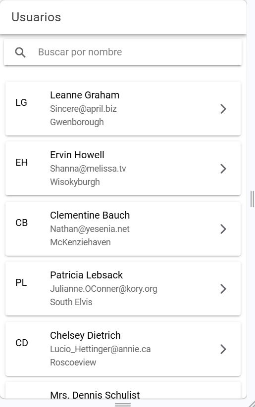
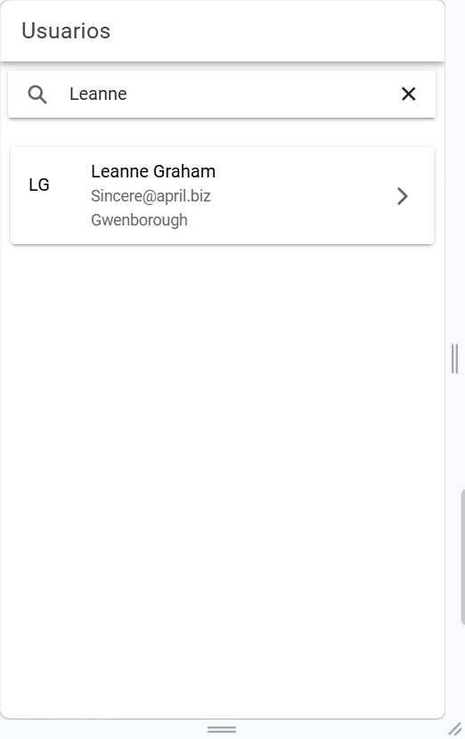
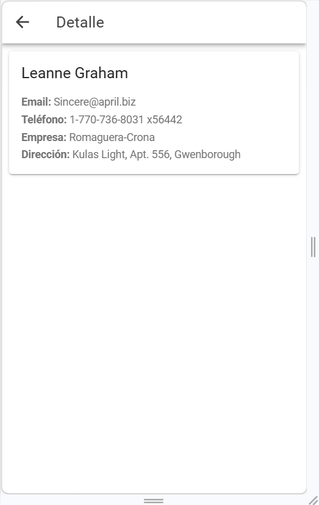
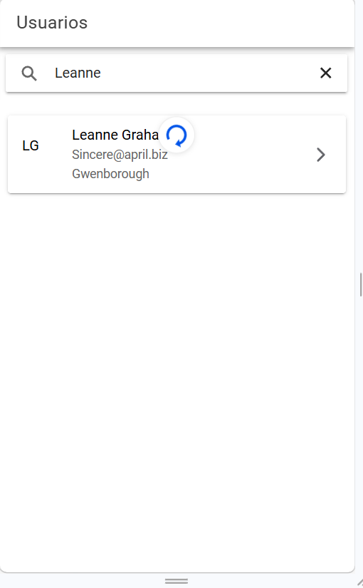

# Users App Periferia IT- Ionic Angular

## Instalación

`npm install`

## Ejecutar

`ionic serve`

## Funcionalidades

- Lista de usuarios
- Búsqueda por nombre
- Pull to refresh
- Pantalla detalle
- Loader
- Manejo de errores

## Capturas

### 1. Pantalla principal

### 2. Lista de usuarios

### 3. Detalle de usuario

### 4. Pull to refresh

